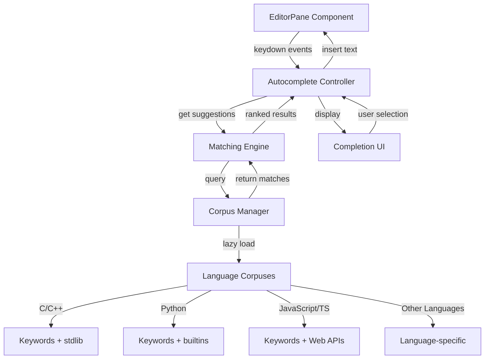

# Design Document: Intelligent Autocomplete

## Overview

The intelligent autocomplete system provides real-time code completion suggestions as users type in the Axiom IDE. The system is designed to be lightweight, fast, and non-intrusive, supporting all 25+ languages currently available in the IDE's syntax highlighter.

The design follows a modular architecture with three main components:
1. **Corpus Manager**: Manages language-specific keyword and identifier collections
2. **Matching Engine**: Performs fast prefix-based matching against the corpus
3. **Completion UI**: Displays suggestions and handles user interaction

The system integrates seamlessly with the existing EditorPane component, using event listeners to trigger autocomplete without modifying core editor functionality. Performance is optimized through lazy loading, debouncing, and efficient data structures (Trie-based matching).

## Architecture

### High-Level Architecture



### Component Interaction Flow

1. **Trigger Phase**: User types in editor → EditorPane emits keydown event → Autocomplete Controller receives event
2. **Matching Phase**: Controller extracts prefix → Matching Engine queries Corpus Manager → Trie-based search returns matches
3. **Display Phase**: Ranked suggestions sent to Completion UI → UI renders dropdown near cursor
4. **Selection Phase**: User navigates with arrows/Tab → Controller inserts selected text → UI dismisses

### Integration Points

- **EditorPane.svelte**: Attach event listeners for keydown, blur, scroll
- **New Component**: `Autocomplete.svelte` - manages UI and controller logic
- **New Utility**: `src/lib/utils/autocomplete.ts` - corpus manager and matching engine
- **New Data**: `src/lib/data/corpuses/` - language-specific corpus files

## Components and Interfaces

### 1. Autocomplete Controller

**Responsibility**: Orchestrates autocomplete lifecycle, manages state, coordinates between editor and UI.

**Interface**:
```typescript
class AutocompleteController {
  // Initialize with editor element reference
  constructor(editorElement: HTMLTextAreaElement)
  
  // Handle keyboard events from editor
  handleKeyDown(event: KeyboardEvent): void
  
  // Handle editor blur (hide UI)
  handleBlur(): void
  
  // Handle editor scroll (reposition UI)
  handleScroll(): void
  
  // Get current suggestions based on cursor position
  getSuggestions(): Suggestion[]
  
  // Insert selected suggestion into editor
  insertSuggestion(suggestion: Suggestion): void
  
  // Show/hide completion UI
  show(): void
  hide(): void
  
  // Navigate suggestions
  selectNext(): void
  selectPrevious(): void
  
  // Cleanup
  destroy(): void
}
```

**Key Behaviors**:
- Debounces input events (50ms) to avoid excessive matching
- Extracts word prefix at cursor position
- Determines if autocomplete should trigger based on context
- Manages active suggestion index
- Handles Tab key to accept suggestions
- Handles Escape/Arrow keys for navigation

### 2. Corpus Manager

**Responsibility**: Loads, stores, and provides access to language-specific keyword corpuses.

**Interface**:
```typescript
interface CorpusManager {
  // Load corpus for a specific language (lazy)
  loadCorpus(language: Language): Promise<void>
  
  // Get corpus for a language (returns empty if not loaded)
  getCorpus(language: Language): Corpus
  
  // Check if corpus is loaded
  isLoaded(language: Language): boolean
  
  // Preload commonly used languages
  preloadCommon(): Promise<void>
  
  // Get memory usage statistics
  getMemoryUsage(): number
}

interface Corpus {
  language: Language
  entries: CorpusEntry[]
  trie: TrieNode  // For fast prefix matching
}

interface CorpusEntry {
  text: string
  type: 'keyword' | 'function' | 'type' | 'constant' | 'variable'
  description?: string
  category?: string
}
```

**Corpus Structure**:
Each language has a JSON file in `src/lib/data/corpuses/`:
```json
{
  "language": "python",
  "entries": [
    { "text": "def", "type": "keyword", "category": "function-definition" },
    { "text": "print", "type": "function", "description": "Print to stdout" },
    { "text": "str", "type": "type", "description": "String type" }
  ]
}
```

**Lazy Loading Strategy**:
- Corpuses loaded on first use for a language
- Common languages (JS, TS, Python, C, C++) preloaded on IDE startup
- Corpuses cached in memory after loading
- Maximum 50MB total memory budget

### 3. Matching Engine

**Responsibility**: Performs fast prefix-based matching against corpus using Trie data structure.

**Interface**:
```typescript
interface MatchingEngine {
  // Find matches for a prefix in a corpus
  match(prefix: string, corpus: Corpus, maxResults: number): Suggestion[]
  
  // Build Trie from corpus entries
  buildTrie(entries: CorpusEntry[]): TrieNode
}

interface Suggestion {
  text: string
  type: 'keyword' | 'function' | 'type' | 'constant' | 'variable'
  description?: string
  score: number  // Relevance score for ranking
}

interface TrieNode {
  char: string
  children: Map<string, TrieNode>
  isEndOfWord: boolean
  entry?: CorpusEntry
}
```

**Matching Algorithm**:
1. Convert prefix to lowercase for case-insensitive matching
2. Traverse Trie to find node matching prefix
3. Collect all words reachable from that node (DFS)
4. Rank results:
   - Exact prefix match (score: 100)
   - Starts with prefix (score: 90)
   - Contains prefix (score: 70)
5. Sort by score descending
6. Return top N results (default: 10)

**Performance Characteristics**:
- Trie construction: O(n * m) where n = entries, m = avg length
- Prefix search: O(p + k) where p = prefix length, k = results
- Memory: O(n * m) for Trie storage
- Target: < 16ms for 10,000 entry corpus

### 4. Completion UI Component

**Responsibility**: Renders suggestion dropdown, handles visual presentation and user interaction.

**Interface** (Svelte Component):
```typescript
// Autocomplete.svelte
export let visible: boolean = false
export let suggestions: Suggestion[] = []
export let activeIndex: number = 0
export let position: { x: number, y: number }
export let onSelect: (suggestion: Suggestion) => void
export let onDismiss: () => void
```

**Visual Design**:
- Dropdown positioned below cursor (or above if insufficient space)
- Maximum 10 items visible, scrollable if more
- Active item highlighted with background color
- Monospace font matching editor
- Syntax-aware coloring (keywords blue, functions yellow, etc.)
- Subtle shadow and border for depth
- Smooth fade-in animation (100ms)

**Positioning Logic**:
```typescript
function calculatePosition(cursorPos: CursorPosition, editorBounds: DOMRect): Position {
  const x = cursorPos.x
  const y = cursorPos.y + lineHeight
  
  // Check if dropdown would overflow bottom
  if (y + dropdownHeight > editorBounds.bottom) {
    // Position above cursor instead
    return { x, y: cursorPos.y - dropdownHeight }
  }
  
  return { x, y }
}
```

### 5. Trigger Detection

**Responsibility**: Determines when autocomplete should activate based on context.

**Logic**:
```typescript
function shouldTrigger(event: KeyboardEvent, cursorContext: CursorContext): boolean {
  // Don't trigger on special keys
  if (event.ctrlKey || event.metaKey || event.altKey) return false
  
  // Don't trigger on navigation keys (except arrows when UI visible)
  if (['Enter', 'Escape', 'Tab'].includes(event.key)) return false
  
  // Trigger on alphanumeric characters
  if (/[a-zA-Z0-9_]/.test(event.key)) return true
  
  // Trigger on language-specific characters
  const triggers = getLanguageTriggers(cursorContext.language)
  if (triggers.includes(event.key)) return true
  
  return false
}

function getLanguageTriggers(language: Language): string[] {
  const triggers: Record<Language, string[]> = {
    'javascript': ['.'],
    'typescript': ['.', ':'],
    'cpp': [':', '.', '>'],  // :: and ->
    'python': ['.'],
    'css': ['-'],
    // ... other languages
  }
  return triggers[language] || []
}
```

## Data Models

### Corpus Entry

Represents a single completable item in a language corpus.

```typescript
interface CorpusEntry {
  text: string              // The completion text (e.g., "function", "console.log")
  type: EntryType           // Category of the entry
  description?: string      // Optional description for tooltips
  category?: string         // Subcategory (e.g., "control-flow", "array-method")
  insertText?: string       // Alternative text to insert (for snippets in future)
}

type EntryType = 
  | 'keyword'      // Language keywords (if, for, class)
  | 'function'     // Functions and methods (print, map, filter)
  | 'type'         // Types and classes (String, Array, int)
  | 'constant'     // Constants (true, false, null, Math.PI)
  | 'variable'     // Common variable names (i, j, index, result)
```

### Suggestion

Represents a matched suggestion ready for display.

```typescript
interface Suggestion {
  text: string              // Display text
  type: EntryType           // For syntax coloring
  description?: string      // For tooltip/detail view
  score: number             // Relevance score (0-100)
  matchedPrefix: string     // The prefix that was matched
}
```

### Cursor Context

Captures the editing context at cursor position.

```typescript
interface CursorContext {
  line: number              // Current line number
  column: number            // Current column number
  lineText: string          // Full text of current line
  prefix: string            // Word prefix before cursor
  language: Language        // Current file language
  charBefore: string        // Character immediately before cursor
  charAfter: string         // Character immediately after cursor
}
```

### Autocomplete State

Manages the current state of the autocomplete system.

```typescript
interface AutocompleteState {
  visible: boolean          // Is UI currently shown
  suggestions: Suggestion[] // Current suggestion list
  activeIndex: number       // Index of highlighted suggestion
  prefix: string            // Current prefix being matched
  position: Position        // UI position on screen
  language: Language        // Current language
  debounceTimer: number     // Timer ID for debouncing
}

interface Position {
  x: number                 // Horizontal position (pixels)
  y: number                 // Vertical position (pixels)
}
```

### Trie Node

Internal data structure for efficient prefix matching.

```typescript
interface TrieNode {
  char: string                      // Character at this node
  children: Map<string, TrieNode>   // Child nodes (key = lowercase char)
  isEndOfWord: boolean              // True if valid word ends here
  entry?: CorpusEntry               // Associated corpus entry if end of word
  depth: number                     // Distance from root (for scoring)
}
```

## Language Corpus Contents

### High-Priority Languages (Preloaded)

**JavaScript/TypeScript**:
- Keywords: async, await, const, let, var, function, class, etc.
- Built-ins: console, Array, Object, String, Number, Promise, etc.
- Web APIs: document, window, fetch, localStorage, etc.
- Common methods: map, filter, reduce, forEach, push, pop, etc.
- ~500 entries

**Python**:
- Keywords: def, class, if, for, while, import, from, etc.
- Built-ins: print, len, range, str, int, list, dict, etc.
- Common modules: os, sys, json, math, datetime, etc.
- ~400 entries

**C/C++**:
- Keywords: int, char, void, struct, class, template, etc.
- Standard library: printf, scanf, malloc, free, std::vector, etc.
- Common headers: stdio.h, stdlib.h, string.h, iostream, etc.
- ~600 entries

### Medium-Priority Languages (Lazy Loaded)

**HTML**: Tags (div, span, a, img, etc.) ~150 entries
**CSS**: Properties (color, margin, padding, display, etc.) ~200 entries
**SQL**: Keywords (SELECT, FROM, WHERE, JOIN, etc.) ~100 entries
**Rust**: Keywords + std library basics ~300 entries
**Go**: Keywords + standard packages ~250 entries
**Java**: Keywords + java.lang + java.util ~400 entries

### Low-Priority Languages (Lazy Loaded)

**Assembly**: Instructions + registers ~200 entries
**Bash**: Commands + built-ins ~150 entries
**Makefile**: Directives + functions ~80 entries
**YAML/JSON/TOML**: Structure keywords ~50 entries each
**Markdown**: Syntax elements ~30 entries

## Error Handling

### Corpus Loading Errors

**Scenario**: Corpus file fails to load (network error, missing file, parse error)

**Handling**:
```typescript
async function loadCorpus(language: Language): Promise<void> {
  try {
    const response = await fetch(`/corpuses/${language}.json`)
    if (!response.ok) {
      console.warn(`Failed to load corpus for ${language}: ${response.status}`)
      // Fall back to empty corpus
      corpuses.set(language, { language, entries: [], trie: createEmptyTrie() })
      return
    }
    
    const data = await response.json()
    const trie = buildTrie(data.entries)
    corpuses.set(language, { language, entries: data.entries, trie })
  } catch (error) {
    console.error(`Error loading corpus for ${language}:`, error)
    // Graceful degradation: autocomplete disabled for this language
    corpuses.set(language, { language, entries: [], trie: createEmptyTrie() })
  }
}
```

### Matching Performance Degradation

**Scenario**: Matching takes longer than 16ms threshold

**Handling**:
- Implement timeout mechanism
- If timeout exceeded, return partial results
- Log warning for performance monitoring
- Consider reducing corpus size or optimizing Trie

```typescript
function matchWithTimeout(prefix: string, corpus: Corpus, timeout: number = 16): Suggestion[] {
  const startTime = performance.now()
  const results: Suggestion[] = []
  
  // Perform matching with periodic time checks
  const matches = findMatches(prefix, corpus.trie)
  
  for (const match of matches) {
    if (performance.now() - startTime > timeout) {
      console.warn(`Matching timeout exceeded for prefix "${prefix}"`)
      break
    }
    results.push(match)
    if (results.length >= 10) break
  }
  
  return results
}
```

### UI Positioning Edge Cases

**Scenario**: Cursor near edge of editor, insufficient space for dropdown

**Handling**:
- Detect available space above and below cursor
- Position dropdown above cursor if insufficient space below
- Constrain dropdown width to editor bounds
- Scroll dropdown into view if needed

### Memory Limit Exceeded

**Scenario**: Total corpus memory exceeds 50MB budget

**Handling**:
- Implement LRU cache for corpuses
- Unload least recently used corpuses when limit approached
- Prioritize keeping common languages loaded
- Log warning if memory pressure detected

## Testing Strategy

The autocomplete system will be tested using both unit tests and property-based tests to ensure correctness and performance.

### Unit Testing Approach

**Corpus Manager Tests**:
- Test lazy loading of corpuses
- Test corpus caching behavior
- Test memory usage tracking
- Test error handling for missing/invalid corpus files

**Matching Engine Tests**:
- Test exact prefix matches
- Test case-insensitive matching
- Test ranking algorithm
- Test result limiting (max 10)
- Test empty prefix handling
- Test no-match scenarios

**Trigger Detection Tests**:
- Test alphanumeric character triggers
- Test language-specific triggers (., ::, etc.)
- Test non-trigger characters (whitespace, punctuation)
- Test modifier key combinations (Ctrl+key should not trigger)

**UI Positioning Tests**:
- Test positioning below cursor (normal case)
- Test positioning above cursor (near bottom edge)
- Test repositioning on scroll
- Test repositioning on cursor move

### Property-Based Testing Approach

Property-based tests will validate universal behaviors across many generated inputs. Each property test will run a minimum of 100 iterations with randomized inputs.

**Test Configuration**:
- Library: fast-check (for TypeScript/JavaScript)
- Iterations: 100 minimum per property
- Tagging: Each test tagged with feature name and property number

### Integration Testing

**End-to-End Scenarios**:
- Type in editor → suggestions appear → select with Tab → text inserted
- Type in editor → suggestions appear → press Escape → UI dismisses
- Type in editor → suggestions appear → continue typing → suggestions update
- Switch between files of different languages → correct corpus loaded

### Performance Testing

**Benchmarks**:
- Measure matching time for various corpus sizes (100, 1000, 10000 entries)
- Measure memory usage for all loaded corpuses
- Measure UI render time
- Measure end-to-end latency (keypress to suggestion display)

**Performance Targets**:
- Matching: < 16ms for 10,000 entries
- Memory: < 50MB total
- UI render: < 100ms
- End-to-end: < 150ms


## Correctness Properties

A property is a characteristic or behavior that should hold true across all valid executions of a system—essentially, a formal statement about what the system should do. Properties serve as the bridge between human-readable specifications and machine-verifiable correctness guarantees.

### Property 1: Language Corpus Loading

*For any* supported language, when a file of that language is opened, the system should load the appropriate corpus, and if the language is unsupported, autocomplete should be disabled.

**Validates: Requirements 1.1, 1.2, 1.3**

### Property 2: Corpus Lazy Loading and Caching

*For any* language corpus, it should not be loaded until first requested, and once loaded, subsequent accesses should return the cached corpus without reloading.

**Validates: Requirements 2.2, 2.3**

### Property 3: Corpus Completeness

*For any* supported language, its corpus should contain entries of all expected types (keywords, functions, types) relevant to that language.

**Validates: Requirements 2.1**

### Property 4: Prefix Matching Correctness

*For any* prefix string and corpus, all returned suggestions should start with that prefix (case-insensitive).

**Validates: Requirements 3.2, 3.3**

### Property 5: Case-Insensitive Matching Consistency

*For any* prefix string in any case combination (lowercase, uppercase, mixed), matching should return equivalent results.

**Validates: Requirements 3.3**

### Property 6: Suggestion Ranking

*For any* set of matching suggestions, those with exact prefix matches should have higher scores than those with partial matches, and results should be sorted by score descending.

**Validates: Requirements 3.4**

### Property 7: Result Limiting

*For any* prefix that matches more than 10 corpus entries, the matching engine should return exactly 10 suggestions.

**Validates: Requirements 3.5**

### Property 8: Matching Performance

*For any* corpus with up to 10,000 entries and any prefix, the matching operation should complete within 16 milliseconds.

**Validates: Requirements 3.1, 9.1**

### Property 9: Trigger Character Activation

*For any* alphanumeric character or language-specific trigger character, typing it should activate the autocomplete system.

**Validates: Requirements 4.1, 4.2**

### Property 10: Non-Trigger Dismissal

*For any* whitespace or non-trigger punctuation character, typing it should hide the completion UI if visible.

**Validates: Requirements 4.3**

### Property 11: Empty Result Handling

*For any* prefix that matches zero corpus entries, the completion UI should be hidden.

**Validates: Requirements 4.5**

### Property 12: UI Display Constraint

*For any* set of suggestions, the completion UI should display at most 10 items.

**Validates: Requirements 5.2**

### Property 13: Dynamic UI Repositioning

*For any* cursor position change or scroll event, the completion UI should reposition itself to remain near the cursor and visible.

**Validates: Requirements 5.5, 5.6**

### Property 14: Navigation Wrapping

*For any* suggestion list, pressing Down Arrow at the last item should wrap to the first item, and pressing Up Arrow at the first item should wrap to the last item.

**Validates: Requirements 6.3, 6.4**

### Property 15: Arrow Key Navigation

*For any* active suggestion index that is not at a boundary, pressing Down Arrow should increment the index and pressing Up Arrow should decrement it.

**Validates: Requirements 6.1, 6.2**

### Property 16: Tab Completion Insertion

*For any* active suggestion, pressing Tab should insert the suggestion text, replace the current prefix, hide the UI, and position the cursor immediately after the inserted text.

**Validates: Requirements 7.1, 7.2, 7.3, 7.4**

### Property 17: Dynamic Filtering

*For any* typing sequence, as the prefix changes, the suggestions should update to match the new prefix, and if no matches exist, the UI should hide.

**Validates: Requirements 8.1, 10.5**

### Property 18: Debouncing Behavior

*For any* rapid sequence of keystrokes within 50ms, the matching engine should be invoked at most once per 50ms window.

**Validates: Requirements 9.4**

### Property 19: Undo Integration

*For any* completion insertion, performing undo should revert the editor content to the state before the insertion.

**Validates: Requirements 10.2**

### Property 20: Keyboard Shortcut Preservation

*For any* editor keyboard shortcut (Ctrl+S, Ctrl+Z, Ctrl+Y, etc.), it should continue to function correctly when autocomplete is active.

**Validates: Requirements 10.4**

### Property 21: Multiple Suggestion Sources

*For any* set of suggestion sources, the system should merge their results and rank them by relevance score.

**Validates: Requirements 11.3**
