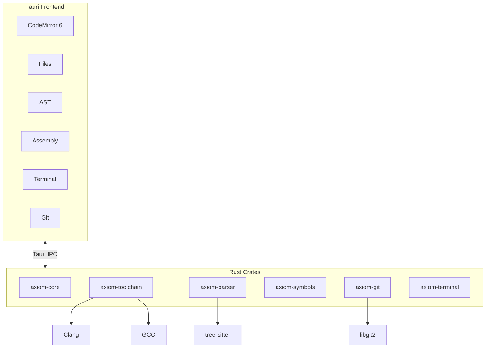

<p align="center">
  
</p>

<p align="center">
  <em>by HawkLogic Systems</em>
</p>

---


> Your compiler doesn't guess. Your debugger doesn't speculate. Why should your IDE?

---

## The Problem

Modern IDEs have become slot machines. Type a few characters, watch the AI spin up suggestions pulled from code you've never seen, written by people who've never touched your hardware. The autocomplete ranking changes based on... what, exactly? Nobody knows. It's probabilistic. It's cloud-connected. It's watching you.

Embedded systems engineers deserve better. When you're writing firmware that controls brakes, pacemakers, or flight surfaces, "probably correct" isn't good enough.

## The Instrument
**Axiom** is not a productivity tool. It's an instrument panel.

Like the gauges in a cockpit, Axiom displays *what is* — not what might be, could be, or statistically tends to be. Every reading comes from your code, your compiler, your hardware.

| Axiom Shows | Source |
|-------------|--------|
| Completions | Your symbol table |
| Errors | Your compiler |
| AST | Your parser |
| Assembly | Your toolchain |
| State | Your debugger |

No AI. No cloud. No telemetry. No magic.

## The Axioms

These are not preferences. They are constraints.

```
1. No generative AI        → Autocomplete is deterministic
2. No cloud services       → Your code never leaves your machine  
3. No telemetry            → Zero bytes transmitted
4. No speculation          → Only ground truth
5. No probabilistic output → Same input, same output. Always.
```

If this sounds limiting, it is. That's the point.

## Who This Is For

- Embedded C/C++ engineers
- RTOS and kernel developers  
- Bare-metal ARM Cortex-M engineers
- Safety-critical domain engineers

## Who This Is Not For

- Web developers looking for AI autocomplete
- Anyone who wants their IDE to "just figure it out"
- People who think telemetry is fine if it's anonymized

---

## Architecture



## Stack

| Layer | Choice | Why |
|-------|--------|-----|
| Backend | Rust | If it compiles, it works |
| Frontend | Svelte | Fast, small, no virtual DOM |
| Editor | CodeMirror 6 | Extensible, no AI baggage |
| Desktop | Tauri 2 | 10MB binary, not 200MB Electron |
| Parsing | tree-sitter | Incremental, battle-tested |
| Git | libgit2 | No shelling out |

## Features

### Editor
- Tab-triggered autocomplete. Not "smart" — *correct*.
- Symbol-table driven. Alphabetically ordered.
- Same query, same results. Every time.

### Panels
- **AST Viewer** — See what the parser sees
- **Assembly** — Disassembly linked to source
- **Terminal** — Real PTY, not a toy
- **Git** — Status, diff, stage, commit. Offline.

### Toolchains
- Detects Clang, GCC, ARM GCC from known paths
- Never mutates your PATH
- Bundled Python 3.11 for build scripts
- Explicit over implicit. Always.

#### ARM Embedded Development

Axiom provides comprehensive support for ARM Cortex-M embedded development with deterministic, ground-truth toolchain integration.

**Toolchain Detection**
- Automatically finds ARM GCC (arm-none-eabi-gcc) from:
  - Homebrew installations (`/opt/homebrew/bin`)
  - STM32CubeIDE bundles
  - System paths (`/usr/bin`, `/usr/local/bin`)
- Validates complete toolchain suite (gcc, g++, as, ld, objcopy, objdump, size, gdb)
- Reports missing tools with installation suggestions
- Supports multiple toolchain versions side-by-side

**Compilation & Linking**
- MCU-specific compiler flags (CPU, FPU, ABI)
- Linker script support with memory map generation
- Binary output formats (ELF, Intel HEX, raw binary)
- Size reporting and memory usage analysis
- Deterministic builds (same input → same output)

**Compiler Visualization**
- Preprocessor output (macro expansion)
- Assembly code generation
- Object file disassembly
- Symbol tables and section headers
- IR dumps for optimization analysis

**Makefile Integration**
- Detects and parses existing Makefiles
- Executes make targets with proper toolchain environment
- Supports common targets (all, clean, flash, debug)
- Real-time build output streaming

**DO-178C/DO-330/ARP4754A Compliance** (Safety-Critical Avionics)
- Bidirectional requirements traceability (REQ-xxx annotations)
- Structural coverage analysis (statement, branch, MC/DC)
- Tool qualification logging for DO-330
- Certification artifact generation (PDF, CSV, XML)
- System-level requirements allocation
- Safety assessment integration (FHA, PSSA, SSA)
- **Zero AI-generated content** - all compliance artifacts are human-authored and verifiable

### Quick Start Examples

**1. Detect Available Toolchains**

```rust
use axiom_toolchain::detect_arm_toolchains;

// Find all ARM toolchains on the system
let toolchains = detect_arm_toolchains();

for tc in &toolchains {
    println!("Found: {} v{}", tc.source, tc.version);
    println!("  Path: {}", tc.gcc.display());
    println!("  Status: {:?}", tc.status);
}
```

**2. Compile for STM32F4 (Cortex-M4 with FPU)**

```rust
use axiom_toolchain::{ArmCompileRequest, ArmMcuConfig, compile_arm};

// Configure for Cortex-M4 with hardware FPU
let mcu = ArmMcuConfig::cortex_m4()
    .with_define("STM32F407xx")
    .with_define("USE_HAL_DRIVER");

// Compile source file
let request = ArmCompileRequest::new(
    "src/main.c".into(),
    "build/main.o".into(),
    mcu,
)
.with_include_path("Core/Inc")
.with_include_path("Drivers/STM32F4xx_HAL_Driver/Inc")
.with_optimization(2)
.with_debug(true);

let result = compile_arm(&toolchain.gcc, &request)?;
```

**3. Link with Memory Map Generation**

```rust
use axiom_toolchain::{ArmLinkRequest, LinkerConfig, link_arm};

// Configure linker
let linker = LinkerConfig {
    script: "STM32F407VGTx_FLASH.ld".into(),
    generate_map: true,
    map_path: Some("build/firmware.map".into()),
    flags: vec![],
};

// Link object files
let request = ArmLinkRequest {
    objects: vec!["build/main.o".into(), "build/startup.o".into()],
    output: "build/firmware.elf".into(),
    linker,
    mcu: mcu_config,
};

let result = link_arm(&toolchain.gcc, &request)?;
```

**4. Generate Binary Outputs**

```rust
use axiom_toolchain::{BinaryOutputConfig, generate_binary};

// Generate HEX and BIN files
let config = BinaryOutputConfig {
    hex: true,
    bin: true,
    size_report: true,
};

let result = generate_binary(
    &toolchain.objcopy,
    &toolchain.size,
    "build/firmware.elf",
    config,
)?;

println!("Flash usage: {} bytes", result.size_stats.text);
println!("RAM usage: {} bytes", result.size_stats.data + result.size_stats.bss);
```

**5. View Compiler Stages**

```rust
use axiom_toolchain::{get_preprocessor_output, get_assembly_output};

// See preprocessor output (macro expansion)
let preprocessed = get_preprocessor_output(
    &toolchain.gcc,
    "src/main.c",
    &mcu_config,
)?;

// See generated assembly
let assembly = get_assembly_output(
    &toolchain.gcc,
    "src/main.c",
    &mcu_config,
)?;
```

**6. DO-178C Compliance Mode**

```rust
use axiom_compliance::{enable_compliance_mode, ComplianceMode};

// Enable DO-178C traceability and coverage
enable_compliance_mode(ComplianceMode::Do178c)?;

// Source code with requirement annotations
// REQ-001: Initialize system clock to 168 MHz
void SystemClock_Config(void) {
    // Implementation...
}

// Test with traceability
// TEST: REQ-001
void test_system_clock(void) {
    // Test implementation...
}

// Generate traceability matrix
let matrix = get_traceability_matrix(".")?;
println!("Requirements traced: {}", matrix.links.len());

// Generate coverage report
let coverage = get_coverage_report(".")?;
println!("Statement coverage: {:.1}%", coverage.total_statement);
```

### Project Configuration

Create `.axiom/toolchain.toml` in your project root:

```toml
[arm]
mcu = "cortex-m7"
fpu = "fpv5-d16"
float_abi = "hard"
linker_script = "STM32H750VBTX_FLASH.ld"

[arm.defines]
values = ["STM32H750xx", "USE_HAL_DRIVER", "USE_PWR_LDO_SUPPLY"]

[arm.include_paths]
values = [
    "Core/Inc",
    "Drivers/STM32H7xx_HAL_Driver/Inc",
    "Drivers/CMSIS/Device/ST/STM32H7xx/Include",
    "Drivers/CMSIS/Include"
]

[compliance]
do178c_enabled = true
do330_enabled = true
dal = "B"  # Design Assurance Level
```

### Supported MCU Families

| MCU Series | Core | FPU | Example |
|------------|------|-----|---------|
| STM32F0/L0 | Cortex-M0 | No | `mcu = "cortex-m0"` |
| STM32F1/L1 | Cortex-M3 | No | `mcu = "cortex-m3"` |
| STM32F3/F4 | Cortex-M4 | Single | `mcu = "cortex-m4"`, `fpu = "fpv4-sp-d16"` |
| STM32F7/H7 | Cortex-M7 | Double | `mcu = "cortex-m7"`, `fpu = "fpv5-d16"` |
| nRF52 | Cortex-M4 | Single | `mcu = "cortex-m4"`, `fpu = "fpv4-sp-d16"` |

See [docs/arm-toolchain-config.md](docs/arm-toolchain-config.md) for complete configuration reference.

---


## Installation

### Prerequisites
- macOS 12+ (Apple Silicon or Intel)
- Rust 1.75+
- Node.js 20+

### Build

```bash
git clone https://github.com/hawklogic/axiom.git
cd axiom
npm install
./scripts/build.sh
```

Output: `src-tauri/target/release/bundle/`

### Development

```bash
./scripts/dev.sh        # Run with hot reload
./scripts/test_fast.sh  # Rust tests
./scripts/test_full.sh  # Full suite + lints
```

---

## Project Structure

```
axiom/
├── crates/
│   ├── axiom-core/        # Types, errors
│   ├── axiom-settings/    # TOML config
│   ├── axiom-toolchain/   # Compiler detection
│   ├── axiom-parser/      # tree-sitter
│   ├── axiom-symbols/     # Autocomplete index
│   ├── axiom-git/         # libgit2 wrapper
│   └── axiom-terminal/    # PTY sessions
├── src/                   # Svelte frontend
├── src-tauri/             # Tauri shell
└── docs/                  # The fine print
```

## Documentation

- [Philosophy](docs/philosophy.md) — The non-negotiables
- [Brand](docs/brand.md) — ICARUS aesthetic
- [Voice](docs/voice.md) — How Axiom speaks
- [ADRs](docs/adr/) — Why we chose what we chose

---

## Contributing

See [CONTRIBUTING.md](CONTRIBUTING.md).

**Hard no**: AI features, cloud services, telemetry. Don't ask.

## License

Apache-2.0

---

<p align="center">
  
</p>

<p align="center">
  <strong>Axiom</strong><br>
  <em>The instrument, not the pilot.</em>
</p>

<p align="center">
  <sub>by HawkLogic Systems</sub>
</p>
