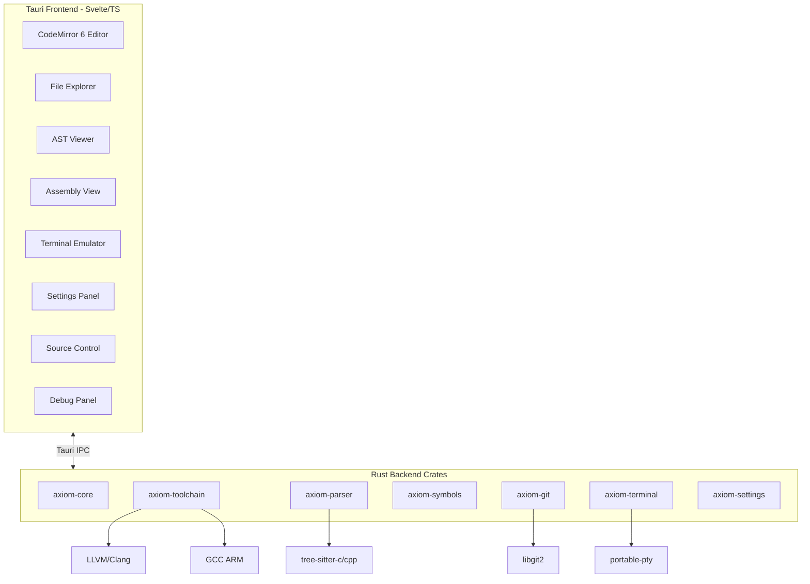

# Axiom

**Deterministic. Inspectable. Offline.**

Axiom is an avionics-grade IDE for embedded systems engineers. Built for those who work close to the metal.

*A HawkLogic Systems project.*

> **Status**: Work in progress — Backend crates scaffolded, UI forthcoming.

---

## Architecture



## Technology Stack

| Component | Technology | Rationale |
|-----------|------------|-----------|
| Backend | Rust | Safety, performance, Tauri native |
| Frontend | Svelte + TypeScript | Lightweight, reactive, fast |
| Editor | CodeMirror 6 | Extensible, deterministic, no AI |
| Desktop | Tauri 2.x | Small binary, native perf, Rust IPC |
| Parsing | tree-sitter | Incremental, C/C++ grammars |
| Git | git2-rs | libgit2 bindings, offline |
| Terminal | portable-pty | Cross-platform PTY |
| Settings | TOML | Human-readable, versioned |
| Python | Bundled CPython 3.11 | Pinned, no system dependency |

---

## What is Axiom?

Axiom is an instrument panel, not a productivity tool. It reveals ground truth:

- **Compiler output** — What your compiler actually said
- **AST structure** — What the parser actually parsed
- **ABI rules** — What the binary interface actually is
- **ISA semantics** — What instructions actually do
- **Debugger state** — What the hardware actually shows

## What Axiom is NOT

- Not an AI assistant
- Not a cloud service
- Not a telemetry collector
- Not a "smart" IDE

## Philosophy

Axiom is built on immutable principles:

1. **No generative AI** — Autocomplete is symbol-table driven, deterministic
2. **No cloud services** — Your code never leaves your machine
3. **No telemetry** — Zero bytes transmitted
4. **No speculation** — Only ground truth
5. **No probabilistic behavior** — Same input → same output

See [docs/philosophy.md](docs/philosophy.md) for the full philosophy.

## Target Audience

- Embedded C/C++ engineers
- RTOS and kernel developers
- Bare-metal ARM Cortex-M engineers
- Safety-critical and regulated-domain engineers

## Features

### Editor
- CodeMirror 6 with C/C++ syntax highlighting
- Tab-triggered autocomplete (symbol-table driven, deterministic)
- Alphabetical ordering within symbol kind — no AI ranking

### UI Panels
- **File Explorer** — Tree view with context menu
- **AST Viewer** — Tree-sitter node display, click-to-navigate
- **Assembly View** — Disassembly output, linked to source lines
- **Terminal** — Integrated PTY with ANSI rendering
- **Source Control** — Git status, staging, diff view
- **Settings Panel** — Categorized settings UI
- **Debug Panel** — Breakpoints, watch, call stack, registers, memory (stub for v1)

### Toolchains
- Automatic detection: Clang, GCC, ARM GCC
- Manual override via settings
- Bundled Python 3.11 for build scripts (no system dependency)
- No PATH mutation — explicit paths only

### Git Integration
- Status, diff, staging, commit via libgit2
- Fully offline — no network calls

### Themes
- Dark (default) and light
- High contrast, instrument-panel aesthetic

## Platform

- **Primary**: macOS (Apple Silicon)
- **Future**: Linux, Windows

## Installation

### Prerequisites

- macOS 12+ (Apple Silicon or Intel)
- Rust 1.75+ (for building from source)
- Node.js 20+ (for building from source)

### From Source

```bash
git clone https://github.com/hawklogic/axiom.git
cd axiom
npm install
scripts/build.sh
```

The built application will be in `src-tauri/target/release/bundle/`.

### Development

```bash
# Run in development mode
scripts/dev.sh

# Run tests
scripts/test_fast.sh

# Run full test suite with lints
scripts/test_full.sh
```

## Configuration

Settings are stored in TOML format at:
- macOS: `~/Library/Application Support/com.hawklogic.axiom/settings.toml`

See Settings panel in the app for all options.

## Project Structure

```
axiom/
├── crates/                 # Rust backend crates
│   ├── axiom-core/         # Shared types, config, errors
│   ├── axiom-settings/     # TOML settings, schema, migrations
│   ├── axiom-toolchain/    # Toolchain detection & invocation
│   ├── axiom-parser/       # Tree-sitter C/C++ parsing
│   ├── axiom-symbols/      # Symbol index, autocomplete
│   ├── axiom-git/          # Git operations via git2
│   └── axiom-terminal/     # Terminal backend via portable-pty
├── src/                    # Svelte frontend
├── src-tauri/              # Tauri application shell
├── vendor/
│   └── python/             # Bundled CPython 3.11
├── docs/                   # Documentation & ADRs
├── scripts/                # Build & test scripts
└── assets/brand/           # SVG logos, icons
```

## Bundled Python

Axiom ships a standalone CPython 3.11 (via [python-build-standalone](https://github.com/indygreg/python-build-standalone)) for:
- Build scripts
- Test runners
- Flash utilities

This avoids system Python dependencies. The bundled interpreter is located at `vendor/python/bin/python3` and is never used for user code — only internal tooling.

## Documentation

- [Philosophy](docs/philosophy.md) — Core principles and constraints
- [Brand](docs/brand.md) — Visual identity (ICARUS aesthetic)
- [Voice](docs/voice.md) — Product voice and tone
- [Workstreams](docs/WORKSTREAMS.md) — Development roadmap
- [Progress](docs/PROGRESS.md) — Current status
- [Decisions](docs/DECISIONS.md) — Decision log

### Architecture Decision Records

- [ADR-0001: Project Scope](docs/adr/0001-project-scope.md)
- [ADR-0002: Toolchains](docs/adr/0002-toolchains.md)
- [ADR-0003: UI Layout](docs/adr/0003-ui-layout.md)

## Contributing

See [CONTRIBUTING.md](CONTRIBUTING.md).

**Note**: We do not accept contributions that add AI features, cloud services, or telemetry. This is non-negotiable.

## License

Apache-2.0. See [LICENSE](LICENSE).

## Acknowledgments

Axiom is built with:
- [Tauri](https://tauri.app/) — Desktop framework
- [Svelte](https://svelte.dev/) — UI framework
- [CodeMirror](https://codemirror.net/) — Editor component
- [tree-sitter](https://tree-sitter.github.io/) — Parsing
- [git2-rs](https://github.com/rust-lang/git2-rs) — Git operations

---

**Axiom** — *The instrument, not the pilot.*

*A HawkLogic Systems project.*
