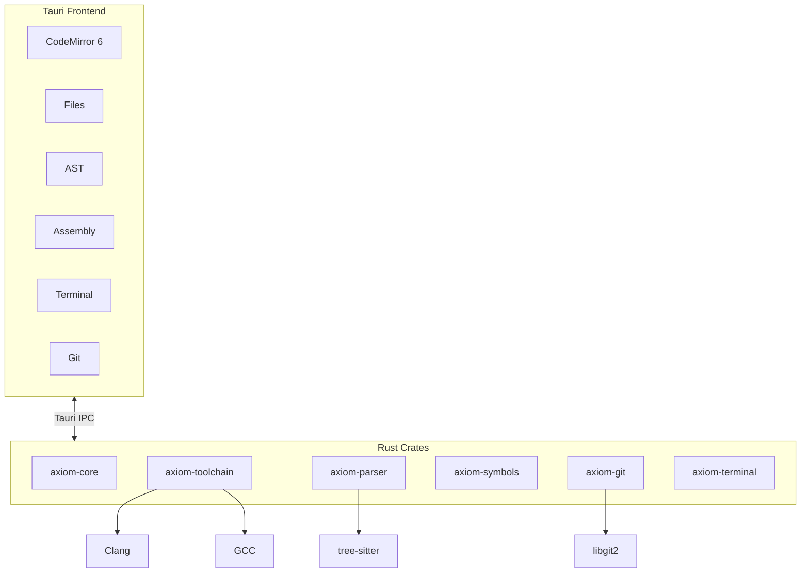

<p align="center">
  
</p>

<p align="center">
  <em>by HawkLogic Systems</em>
</p>

---

> Your compiler doesn't guess. Your debugger doesn't speculate. Why should your IDE?

---

## The Problem

Modern IDEs have become slot machines. Type a few characters, watch the AI spin up suggestions pulled from code you've never seen, written by people who've never touched your hardware. The autocomplete ranking changes based on... what, exactly? Nobody knows. It's probabilistic. It's cloud-connected. It's watching you.

Embedded systems engineers deserve better. When you're writing firmware that controls brakes, pacemakers, or flight surfaces, "probably correct" isn't good enough.

## The Instrument

**Axiom** is not a productivity tool. It's an instrument panel.

Like the gauges in a cockpit, Axiom displays *what is* — not what might be, could be, or statistically tends to be. Every reading comes from your code, your compiler, your hardware.

| Axiom Shows | Source |
|-------------|--------|
| Completions | Your symbol table |
| Errors | Your compiler |
| AST | Your parser |
| Assembly | Your toolchain |
| State | Your debugger |

No AI. No cloud. No telemetry. No magic.

## The Axioms

These are not preferences. They are constraints.

```
1. No generative AI        → Autocomplete is deterministic
2. No cloud services       → Your code never leaves your machine  
3. No telemetry            → Zero bytes transmitted
4. No speculation          → Only ground truth
5. No probabilistic output → Same input, same output. Always.
```

If this sounds limiting, it is. That's the point.

## Who This Is For

- Embedded C/C++ engineers
- RTOS and kernel developers  
- Bare-metal ARM Cortex-M engineers
- Safety-critical domain engineers

## Who This Is Not For

- Web developers looking for AI autocomplete
- Anyone who wants their IDE to "just figure it out"
- People who think telemetry is fine if it's anonymized

---

## Architecture



## Stack

| Layer | Choice | Why |
|-------|--------|-----|
| Backend | Rust | If it compiles, it works |
| Frontend | Svelte | Fast, small, no virtual DOM |
| Editor | CodeMirror 6 | Extensible, no AI baggage |
| Desktop | Tauri 2 | 10MB binary, not 200MB Electron |
| Parsing | tree-sitter | Incremental, battle-tested |
| Git | libgit2 | No shelling out |

## Features

### Editor
- Tab-triggered autocomplete. Not "smart" — *correct*.
- Symbol-table driven. Alphabetically ordered.
- Same query, same results. Every time.

### Panels
- **AST Viewer** — See what the parser sees
- **Assembly** — Disassembly linked to source
- **Terminal** — Real PTY, not a toy
- **Git** — Status, diff, stage, commit. Offline.

### Toolchains
- Detects Clang, GCC, ARM GCC from known paths
- Never mutates your PATH
- Bundled Python 3.11 for build scripts
- Explicit over implicit. Always.

---

## Installation

### Prerequisites
- macOS 12+ (Apple Silicon or Intel)
- Rust 1.75+
- Node.js 20+

### Build

```bash
git clone https://github.com/hawklogic/axiom.git
cd axiom
npm install
./scripts/build.sh
```

Output: `src-tauri/target/release/bundle/`

### Development

```bash
./scripts/dev.sh        # Run with hot reload
./scripts/test_fast.sh  # Rust tests
./scripts/test_full.sh  # Full suite + lints
```

---

## Project Structure

```
axiom/
├── crates/
│   ├── axiom-core/        # Types, errors
│   ├── axiom-settings/    # TOML config
│   ├── axiom-toolchain/   # Compiler detection
│   ├── axiom-parser/      # tree-sitter
│   ├── axiom-symbols/     # Autocomplete index
│   ├── axiom-git/         # libgit2 wrapper
│   └── axiom-terminal/    # PTY sessions
├── src/                   # Svelte frontend
├── src-tauri/             # Tauri shell
└── docs/                  # The fine print
```

## Documentation

- [Philosophy](docs/philosophy.md) — The non-negotiables
- [Brand](docs/brand.md) — ICARUS aesthetic
- [Voice](docs/voice.md) — How Axiom speaks
- [ADRs](docs/adr/) — Why we chose what we chose

---

## Contributing

See [CONTRIBUTING.md](CONTRIBUTING.md).

**Hard no**: AI features, cloud services, telemetry. Don't ask.

## License

Apache-2.0

---

<p align="center">
  
</p>

<p align="center">
  <strong>Axiom</strong><br>
  <em>The instrument, not the pilot.</em>
</p>

<p align="center">
  <sub>by HawkLogic Systems</sub>
</p>
